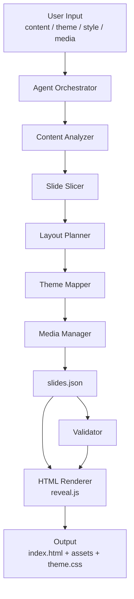

# Presentation Agent Context

## Goal

Build an agent that generates polished `.html` slideshow presentations from user-provided content.

The agent should prefer HTML slides over `.pptx` because HTML offers:

- Better visual freedom
- Better support for custom interactions and animations
- Easier web delivery and embedding
- Better support for audio and video

## Product Direction

Target capabilities:

1. Accept raw content input and automatically slice it into multiple slides
2. Decide slide count based on content density and narrative structure
3. Generate different CSS/theme structures from user inputs such as:
   - Color theme
   - Presentation style
   - Use case, for example:
     - annual meeting
     - work report
     - technology introduction
4. Support embedded audio and video inside slides

## Research Summary

### Overall conclusion

The best approach is not to build a slideshow runtime from scratch.

Instead, reuse:

- a mature HTML slideshow engine
- an agent orchestration layer
- a structured intermediate representation
- a template/theme system

### Best reusable foundations

- `reveal.js`: best choice for MVP HTML-first rendering
- `Slidev`: strong candidate for later advanced component-based evolution
- `Marp/Marpit`: good for fast simple generation, but likely lower ceiling for advanced customization

### Key inspiration from agent/open-source tools

- `Presenton`: useful reference for templates, MCP/API, generation pipeline
- `HTMLSlides`: useful reference for agent-oriented HTML slide generation
- `PPTAgent`: useful reference for content slicing, page planning, and iterative generation
- `PreGenie`: useful evidence that `Slidev + staged generation` is a viable path

### Commercial benchmark products

- Gamma
- Canva AI Presentations
- Beautiful.ai
- Plus AI

These validate that the market wants:

- prompt/content to deck generation
- strong visual theming
- polished output
- multi-media support
- web-native sharing

## Technical Selection

### Recommended MVP stack

- Rendering engine: `reveal.js`
- Intermediate format: `slides.json`
- Theme system: `design tokens + theme presets + CSS variables`
- Media support: native `audio` and `video` in generated HTML
- Generation strategy: staged agent pipeline, not direct one-shot HTML generation

### Why `reveal.js` for MVP

- Mature HTML presentation framework
- Strong plugin ecosystem
- Good support for web-native media
- Easier to output a static presentation directory
- Lower implementation risk than a heavier framework

### Why not start with `Slidev`

`Slidev` is excellent, but it introduces a heavier component/build pipeline.
It is a strong V2 candidate, especially if the product later needs:

- richer dynamic layouts
- component-driven templates
- charts and embedded application widgets
- more advanced authoring workflows

### Why not use `Marp` as the main long-term base

`Marp` is fast and elegant for markdown-to-slides workflows, but it may become limiting for:

- richer layout variation
- interactive media behavior
- more advanced design systems
- complex branded templates

## Final Selection Table

| Dimension | reveal.js | Slidev | Marp |
|---|---|---|---|
| HTML-first output | Excellent | Excellent | Strong |
| Static web delivery | Excellent | Excellent | Strong |
| Theme flexibility | Excellent | Excellent | Moderate |
| Media embedding | Strong | Strong | Moderate |
| Interaction/animation extensibility | Strong | Excellent | Weak to moderate |
| Agent generation controllability | Excellent | Strong | Excellent |
| Implementation cost | Low to medium | Medium | Low |
| Best for MVP | Yes | Possible but heavier | Good but limited |
| Best for long-term advanced templates | Strong | Best | Limited |

## Architecture



## Recommended Data Flow

1. User provides source content and visual preferences
2. Agent analyzes content intent, audience, and scenario
3. Agent slices content into candidate slides
4. Agent selects layout types for each slide
5. Agent maps requested style into tokens and theme rules
6. Agent builds a structured `slides.json`
7. Renderer converts `slides.json` into a `reveal.js` presentation
8. Validator checks overflow, missing assets, and consistency
9. Final output is a static HTML slideshow package

## Intermediate Representation

The generator should not directly output HTML as its first artifact.

Use a structured intermediate representation similar to:

```json
{
  "meta": {
    "title": "AI Presentation Agent",
    "theme": "tech-blue",
    "style": "technology-introduction",
    "aspectRatio": "16:9"
  },
  "slides": [
    {
      "type": "cover",
      "title": "AI Presentation Agent",
      "subtitle": "HTML-first presentation generation"
    },
    {
      "type": "bullet-list",
      "title": "Why HTML",
      "bullets": [
        "Better visual flexibility",
        "Richer interaction",
        "Easier multimedia embedding"
      ]
    },
    {
      "type": "media-right",
      "title": "Product Demo",
      "body": "Demonstrate key features here.",
      "media": {
        "kind": "video",
        "src": "assets/demo.mp4"
      }
    }
  ]
}
```

Benefits:

- separates planning from rendering
- allows renderer replacement later
- makes validation easier
- makes agent output more stable and testable

## MVP Module Breakdown

### 1. Input Parser

Responsibilities:

- accept raw text or markdown
- accept style/theme preferences
- accept media references
- normalize generation options

### 2. Content Analyzer

Responsibilities:

- identify structure and topic hierarchy
- infer presentation intent
- classify tone and use case

### 3. Slide Slicer

Responsibilities:

- split content into slides
- control information density
- estimate slide count

### 4. Layout Planner

Responsibilities:

- assign slide types
- choose from reusable layouts
- keep narrative flow coherent

Example layout types:

- cover
- agenda
- section divider
- bullet list
- two-column comparison
- image/media focus
- summary
- closing page

### 5. Theme Engine

Responsibilities:

- map user style to design tokens
- generate CSS variables
- apply typography, color, spacing, decoration rules

### 6. Media Manager

Responsibilities:

- validate local and remote media paths
- copy referenced assets
- configure slide embedding behavior

Supported media goals:

- local audio
- local video
- remote video URLs
- cover images/posters

### 7. IR Generator

Responsibilities:

- emit valid `slides.json`
- keep schema stable
- support downstream validation and rendering

### 8. HTML Renderer

Responsibilities:

- render `slides.json` into `reveal.js` templates
- generate `index.html`
- generate `theme.css`
- output asset references

### 9. Validator

Responsibilities:

- detect text overflow risks
- detect missing media
- detect invalid theme combinations
- detect poor readability/contrast

### 10. Export Packager

Responsibilities:

- produce final output directory
- optionally zip the result

## MVP Implementation Order

### Phase 1: Rendering baseline

Build the smallest working loop first:

1. hand-write a sample `slides.json`
2. render it into a working `reveal.js` HTML deck
3. verify local open/run behavior

### Phase 2: Theme system

Implement 3 initial theme presets:

- `tech`
- `annual-meeting`
- `business-report`

### Phase 3: Basic slicing

Support these content forms first:

- title
- subtitle
- paragraph
- bullet list
- summary
- media slide

### Phase 4: LLM-assisted structure generation

The LLM should generate structured slide plans and `slides.json`, not raw final HTML.

### Phase 5: Layout planning

Upgrade from uniform bullet slides to varied layout selection.

### Phase 6: Media pipeline

Add support for:

- local `mp3`
- local `mp4`
- remote video links
- poster/cover images

### Phase 7: Validation

Add checks for:

- too much text on one slide
- broken media references
- weak contrast
- title overflow

### Phase 8: Packaging and agent interface

Add a simple CLI or agent entrypoint to run the whole pipeline end to end.

## Recommended MVP Scope

Include:

- input: plain text or markdown
- output: static HTML presentation directory
- themes: 3 presets
- layouts: 6 to 8 reusable layouts
- media: local audio, local video, remote video

Do not include in MVP:

- collaborative editing
- WYSIWYG editor
- advanced chart generation
- pptx export
- full plugin marketplace

## Suggested Project Structure

```text
presentation-agent/
  src/
    orchestrator/
    analyzers/
    slicers/
    planners/
    themes/
    renderers/
    validators/
    media/
  templates/
    reveal/
      base.html
      layouts/
      themes/
  schemas/
    slides.schema.json
  examples/
  output/
```

## Development Roadmap

### Phase 1

- `reveal.js`
- `slides.json`
- 3 themes
- basic slicing

### Phase 2

- stronger layout planning
- validator improvements
- media orchestration

### Phase 3

- evaluate `Slidev`
- richer components
- more advanced design system

## Suggested Next Step In A New Thread

Use this document as the starting context and ask for one of the following:

- scaffold the project skeleton
- define the `slides.json` schema
- build the `reveal.js` renderer
- implement the content slicing pipeline
- implement the theme preset system

## Local Dev Service Restart Memory

Recorded on 2026-04-20 for this workspace.

When restarting the local app, the reliable target state is:

- frontend: `http://localhost:3100`
- backend: `http://localhost:4100/api`
- backend health check: `http://localhost:4100/api/health`
- root dev command: `npm run dev`

Known failure modes in the Codex PowerShell tool environment:

- `Start-Process` can fail with `Item has already been added. Key in dictionary: 'PATH' Key being added: 'Path'`.
- Running `npm run dev` inside the sandbox can fail when `concurrently` tries to spawn child processes with `Error: spawn EPERM`.
- Direct `cmd.exe /c` argument splitting can fail with `The syntax of the command is incorrect`.
- Spawning `npm.cmd` directly from Node can fail on Windows with `spawn EINVAL`.

Preferred restart procedure from Codex:

1. Find listeners with `netstat -ano | Select-String ':3100|:4100'`.
2. Kill only the listener PIDs for `3100` and `4100` with `Stop-Process -Id <pid1>,<pid2> -Force`.
3. Start from the repository root using a detached Node shell spawn outside the sandbox when normal sandbox startup fails:

```powershell
node -e "const fs=require('fs'); const cp=require('child_process'); const cwd='C:/Users/YuanYuan/Person/Software/Codex'; fs.mkdirSync(cwd+'/.local-runtime',{recursive:true}); const out=fs.openSync(cwd+'/.local-runtime/dev-detached.out.log','a'); const err=fs.openSync(cwd+'/.local-runtime/dev-detached.err.log','a'); const p=cp.spawn('npm run dev',{cwd,detached:true,stdio:['ignore',out,err],windowsHide:true,shell:true}); p.unref(); console.log('started pid='+p.pid);"
```

This command may not print a PID in this environment, but it successfully started both services after other launch paths failed.

Always verify with:

```powershell
netstat -ano | Select-String ':3100|:4100'
Invoke-WebRequest -UseBasicParsing http://localhost:3100 -TimeoutSec 8
Invoke-WebRequest -UseBasicParsing http://localhost:4100/api/health -TimeoutSec 8
```

Do not treat stale `TIME_WAIT`, `CLOSE_WAIT`, or `FIN_WAIT_2` rows as active service listeners. Only `LISTENING` rows identify the current server PIDs.

## Research References

### HTML slide engines

- reveal.js: https://revealjs.com/
- reveal.js media: https://revealjs.com/media/
- reveal.js plugins: https://revealjs.com/plugins/
- Slidev: https://sli.dev/
- Slidev why: https://sli.dev/guide/why
- Slidev themes: https://sli.dev/guide/theme-addon
- Slidev components: https://sli.dev/guide/component
- Slidev with AI: https://sli.dev/guide/work-with-ai
- Marp: https://marp.app/
- Marpit theme CSS: https://marpit.marp.app/theme-css

### Agent/open-source references

- Presenton GitHub: https://github.com/presenton/presenton
- Presenton MCP docs: https://docs.presenton.ai/generate-presentation-over-mcp
- HTMLSlides: https://htmlslides.com/
- HTMLSlides article: https://htmlslides.com/blog/open-source-agent-skill-html-slides/
- PPTAgent GitHub: https://github.com/icip-cas/PPTAgent
- PPTAgent paper: https://arxiv.org/abs/2602.22839
- PreGenie paper: https://arxiv.org/abs/2505.21660

### Commercial benchmarks

- Gamma: https://gamma.app/
- Gamma API GA: https://gamma.app/blog/introducing-gamma-api-general-availability
- Canva AI Presentations: https://www.canva.com/create/ai-presentations/
- Beautiful.ai AI presentations: https://www.beautiful.ai/ai-presentations/
- Beautiful.ai help article: https://support.beautiful.ai/hc/en-us/articles/12885226948109-Creating-a-presentation-with-AI
- Plus AI: https://wf.plusdocs.com/
